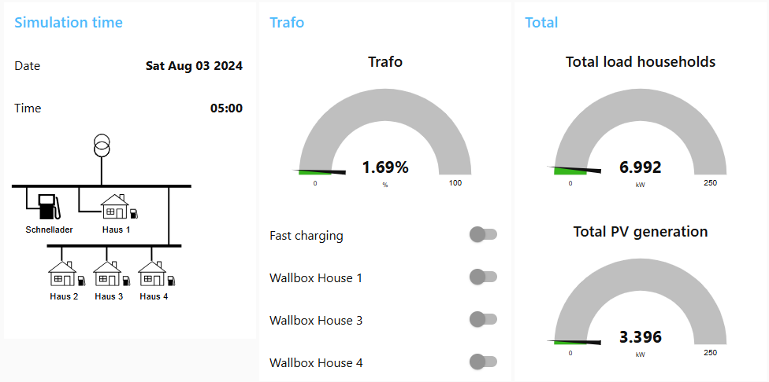

# grid-sim-builder

Grid‑Sim‑Builder is an open‑source toolbox that turns pandapower network models plus simple CSV load profiles into a reproducible, real‑time digital twin of low‑voltage (LV) distribution grids.
It packs the entire workflow—from realistic household‑load synthesis through PV and EV injection all the way to live dashboards—into a single Docker‑Compose stack you can spin up with one command:
```bash
docker compose up -d
```
The modular architecture lets you plug in ML agents, hardware‑in‑the‑loop devices or custom visualisations without touching the core. The same design also makes the simulator perfectly portable: it runs on a laptop for classroom demos as well as on a headless server for week‑long Monte‑Carlo sweeps.

If you need a lightweight yet feature‑complete environment to model PV‑heavy neighbourhoods, evaluate demand‑response schemes or benchmark EV‑charging schedules, Grid‑Sim‑Builder gets you from zero to first results in minutes—while still giving you full access to the underlying pandapower object tree whenever you want to go deep.

| Layer               | Component    | Role                                         |
| ------------------- | ------------ | -------------------------------------------- |
| **Power‑flow core** | *pandapower* | Deterministic AC load‑flow solver            |
| **Time‑series DB**  | InfluxDB 2   | High‑resolution storage for every step       |
| **Messaging bus**   | Mosquitto    | Low‑latency pub/sub for controls & telemetry |
| **Web UI**          | Node‑RED     | Zero‑code dashboards & logic scripting       |


## 🚀  Quick Start

### Load Profiles

The load profiles are located in the `config/hh_data/load_profiles` folder. 
The load profiles used are packed in the `demo_load_profiles.tar.gz` file and must be unpacked.

### Start the Simulation
To start the simulation, you need to have Docker and Docker Compose installed.
```bash
docker compose up -d 
```


## GridServer — A Modular Smart‑LV‑Grid Simulation Backend

**GridServer** is a Python‑based backend that lets you run reproducible
power‑flow simulations for low‑voltage (LV) distribution grids.
Built on top of the open‑source **[pandapower](https://github.com/e2nIEE/pandapower)**
framework, it combines household load profiles, PV generation,
EV‑charging behaviour and more, and streams the results to
**InfluxDB 2** and/or **MQTT** in real time.

---

### ✨  Key Features

| Area | Details |
|------|---------|
| **Network Models** | Built‑in support for the CIGRE LV test grid, the AI4DG microgrid and the AMiRo research grid. |
| **Profiles** | Reads per‑household CSV files for<br>• total load<br>• PV power<br>• optional EV charging. |
| **Operating Modes** | `automatic`, `realtime`, `demo`, `batch` — switchable via one variable. |
| **Time Engine** | Global clock (`global_time`) and step counter (`global_step`, minutes). Default step: **15 min**. |
| **Live I/O** | Publish & control via **MQTT** (`gridserver/...`).<br>Write high‑resolution time series to **InfluxDB** buckets. |
| **Assets in the Loop** | Setter functions to manipulate household loads, PV power, EV charging and batteries on the fly. |
| **Visual Debug** | Plotly one‑line network graph + HTML reports for transformers, lines, loads, PV — injected into MQTT. |
| **Scalable Export** | Buffered InfluxDB writes (`batch_size`, `flush_interval`) and non‑blocking MQTT publishes. |

---

### ⚙️  Operating Modes

| Mode | What happens |
|------|--------------|
| **automatic** | Steps forward on each incoming MQTT `tick`. |
| **realtime** | Clock follows the system time (1 min granularity). |
| **demo** | Runs a single step, renders HTML + Plotly outputs for instant presentations. |
| **batch** | Executes arbitrary time ranges (start / end sent via MQTT) in one go. |

---

### 🛰  Data Interfaces

#### MQTT Topics (publish & subscribe)

| Topic pattern | Meaning |
|---------------|---------|
| `gridserver/hh/<name>/load` | Stream household load and PV power (W). |
| `gridserver/set/hh/<name>/load` | Set  household load (W). |
| `gridserver/hh/<name>/ev` | Stream EV charging power (W). |
| `gridserver/set/hh/<name>/ev` | Set EV charging power (W). |
| `gridserver/trafo/<name>/loading` | Transformer loading (%) result stream. |
| `gridserver/tick` | Trigger time step in non‑realtime modes. |
| `gridserver/set/timestamp` | Set the global time step (in seconds). |
| `gridserver/batch` | Control batch jobs & receive completion notice. |

#### InfluxDB Measurements

| Measurement | Tags | Fields |
|-------------|------|--------|
| `household` | `name` | `load`, `pv`, `voltage` |
| `ev_load` | `name` | `load` |
| `transformer` | `name` | `loading`, `load_lv_kw` |

---

### 🔄  Typical Workflow (Automatic Mode)

1. **Init**  
   * Choose grid model (`used_model`).  
   * Load every household’s CSV profile.  
   * Start MQTT & InfluxDB clients.  

2. **Main Loop**  
   * Wait for an MQTT `tick`.  
   * Map profile rows to the current step.  
   * Update loads, PV, EV, battery values inside the pandapower network.  
   * Run the power flow (`pp.runpp`).  

3. **Export**  
   * Write results to InfluxDB and/or publish via MQTT.  
   * Optionally push HTML/Plotly debug views.  

---

## Node‑RED Front‑End for GridServer

The backend is complemented by a dashboard built with 
[Node‑RED](https://nodered.org/) that turns the raw MQTT streams and
controls exposed by **GridServer** into a full‑featured web dashboard.  
Everything ships in a single JSON flow that you can import.

---

## ✨ Highlights

| Area | Details |
|------|---------|
| **Real‑time metrics** | Transformer loading, total LV‑grid load, PV generation, per‑house loads & EV charging. |
| **Interactive controls** | • Manual “Next Step” & time‑jumps<br>• Fast‑charger & wallbox toggles<br>• Batch‑job form (start + duration) |
| **Clock management** | Date‑picker + hour/min numeric inputs drive `gridserver/set/timestamp` and auto‑tick logic. |
| **Live SVG grid** | Embedded Inkscape SVG updated via MQTT to visualise voltage & EV activity. |
| **Debug panes** | Raw HTML reports (`gridserver/debug/info`). |
| **Mosquitto broker** | All UI nodes connect to the same broker alias **`mosquitto:1883`**. |

---

## 🖥 UI Structure

